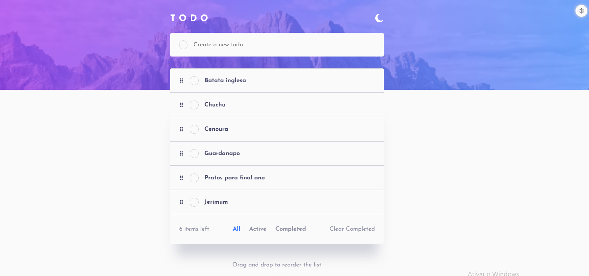

# Frontend Mentor - Todo app solution

This is a solution to the [Todo app challenge on Frontend Mentor](https://www.frontendmentor.io/challenges/todo-app-Su1_KokOW). Frontend Mentor challenges help you improve your coding skills by building realistic projects. 

## Table of contents

- [Overview](#overview)
  - [The challenge](#the-challenge)
  - [Screenshot](#screenshot)
  - [Links](#links)
- [My process](#my-process)
  - [Built with](#built-with)
  - [What I learned](#what-i-learned)
  - [Continued development](#continued-development)
  - [Useful resources](#useful-resources)
- [Author](#author)

## Overview

### The challenge

Users should be able to:

- View the optimal layout for the app depending on their device's screen size
- See hover states for all interactive elements on the page
- Add new todos to the list
- Mark todos as complete
- Delete todos from the list
- Filter by all/active/complete todos
- Clear all completed todos
- Toggle light and dark mode
- **Bonus**: Drag and drop to reorder items on the list
- **Bonus**: Make the todo app fullstack

### Screenshot

### Links

- Solution URL: [Check here](https://github.com/sirbiel100/todo-fullstack)
- Live Site URL: [Check here](https://todo-fullstack-drab.vercel.app/)

## My process

### Built with

- SCSS custom properties
- SCSS Variables
- Flexbox
- CSS Grid
- Mobile-first workflow
- [Supabase](https://supabase.com/) - Postgres' Database
- [React](https://reactjs.org/) - JS library
- [Next.js](https://nextjs.org/) - React framework
- [SASS](https://sass-lang.com/) - For styles

### What I learned

This challenge was one of the challenges I most learned with, it was my first time building a fullstack application alone. I learned a lot of backend and database management.

### Continued development

I intend to continue developing some fullstacks applcation to have a better view about coding.

### Useful resources

- [Supabase documentation](https://supabase.com/docs/reference/javascript/introduction) - This helped me for understand how to use supabase.

## Author

- Website - [Click here](https://gabriel-crispim-portfolio-sirbiel100.vercel.app/)
- Frontend Mentor - [@sirbiel100](https://www.frontendmentor.io/profile/sirbiel100)
- LinkedIn - [Gabriel Crispim](https://www.linkedin.com/in/gabrielrcrispim/)
